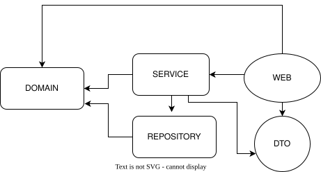
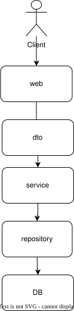

# Arquitectura

## Capas y responsabilidad

| Paquete    | Responsabilidad (una frase)                                                    |
|------------|--------------------------------------------------------------------------------|
| web        | Contiene todo lo relacionado a web en el proyceto                              |
| service    | Contiene la lógica de negocio en la aplicación                                 |
| repository | Se encarga de la comunicación con la BD                                        |
| domain     | Se encaraga de el dominio de la aplicacion todo lo relacionado con el negocion |
| dto        | Se encarga de administrar los DTOS que permiten la transferencia de los datos  |
| exception  | Posee la excepciones específicas de la aplicacion                              |
| config     | Se encarga de las configuraciones de la app                                    |

## Regla de dependencias

Fila = paquete que usa · Columna = paquete usado · ✅ puede / ❌ no puede

| usa ↓ / usado → | web | service | repository | domain | dto |
|-----------------|-----|---------|------------|--------|-----|
| web             |  —  |   ✅    |     ❌     |  ⚠️    | ✅  |
| service         | ❌  |   —     |     ✅     |  ✅    | ⚠️  |
| repository      | ❌  |   ❌    |     —      |  ✅    | ❌  |
| domain          | ❌  |   ❌    |     ❌     |   —    | ❌  |
| dto             | ❌  |   ❌    |     ❌     |  ❌    |  —  |

**En una frase:** las dependencias van en un solo sentido, web → service → repository,
y todas pueden apoyarse en domain; domain no depende de nadie.
**En una frase:** (ej. "las dependencias solo van hacia ...")

## Diagrama

___

