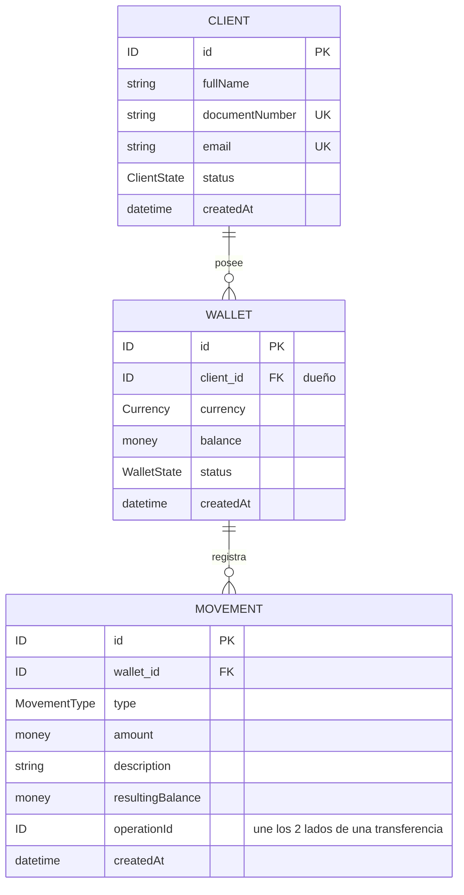

# Mapa de datos

## Entidades

### NombreEntidad

| Campo   | Tipo    | Obligatorio | Restricción                  | Regla |
|---------|---------|-------------|------------------------------|-------|
| Cliente | Entidad | SI          | Tiene un identificador único | RN-XX |

(repetir por cada entidad)

## Relaciones

| Entidad A | Relación            | Entidad B | Cardinalidad          | ¿Quién guarda la referencia? |
|-----------|---------------------|-----------|-----------------------|------------------------------|
|           | tiene / pertenece a |           | 1 a 1 / 1 a N / N a N |                              |

## Diagrama




**Restricción que el diagrama no muestra:** un cliente puede tener muchas
billeteras, pero como máximo una ACTIVA (RN-03).


# Modelo de dominio — Wallet API

```mermaid
erDiagram

    CLIENT ||--o{ WALLET : owns
    WALLET ||--o{ MOVEMENT : contains

    CLIENT {
        UUID id PK
        String fullName
        String dni
        String email
        Instant dateTimeClientRegister
        ClientState currentState
    }

    WALLET {
        UUID id PK
        UUID client_id FK
        Currency currency
        BigDecimal balance
        Instant dateTimeWalletRegister
        WalletState state
    }

    MOVEMENT {
        UUID id PK
        UUID wallet_id FK
        BigDecimal amount
        Instant moment
        String description
        UUID operation_id
        BigDecimal wallet_resultant_balance
        MovementType type
    }