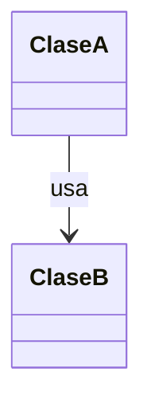

# Estructura planeada – Billetera Clara API

> Diseño vivo: se actualiza a medida que avanzo. Si algo cambia,
> no lo borro, lo marco como "Descartada" y explico por qué (→ D-XXX).

## Regla de dependencias entre capas

(Escribe con tus palabras qué capa puede conocer a cuál. Etapa 3.)

## Paquete: `com.mikko.wallet_api.<paquete>`

**Responsabilidad del paquete:** una frase.

| Clase / Interfaz | Tipo                             | Responsabilidad (una sola) | Colabora con | Estado                         |
|------------------|----------------------------------|----------------------------|--------------|--------------------------------|
| `NombreClase`    | Clase / Interfaz / Enum / Record | Qué hace y qué NO hace     | `OtraClase`  | Planeada / Creada / Descartada |

### Detalle (opcional, cuando llegue a esa etapa)

#### `NombreClase`

- **Por qué existe:**
- **Operaciones principales (en lenguaje natural):**
    - Ej.: "recibe un pedido de X y devuelve Y"
- **Qué nunca debería hacer:**
- **Requisitos que cubre:** RN-XX, AXX

---

## Diagrama (opcional)

